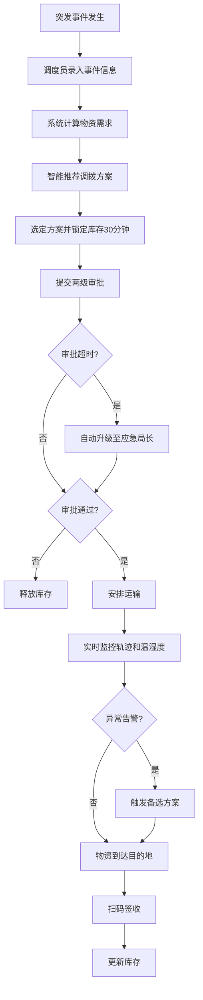
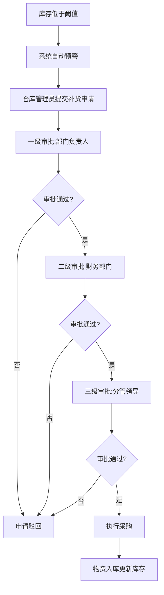

## 1. 产品概述

城市应急物资储备与调拨管理平台是一套面向应急管理部门的智能化物资调度系统，整合多储备库资源，实现突发事件下的快速响应、智能调拨和全流程监控。

- 核心目标：提升应急物资调配效率，缩短响应时间，保障物资安全运输
- 目标用户：应急管理局工作人员、仓库管理员、审批领导、运输调度员
- 产品价值：数字化、可视化、智能化的应急物资全生命周期管理

## 2. 核心功能

### 2.1 用户角色

| 角色 | 注册方式 | 核心权限 |
|------|----------|----------|
| 系统管理员 | 系统创建 | 用户管理、系统配置、全局数据查看 |
| 仓库管理员 | 系统创建 | 库存管理、扫码签收、补货申请 |
| 应急调度员 | 系统创建 | 事件上报、调拨方案生成、运输监控 |
| 审批领导 | 系统创建 | 调拨审批、补货审批、数据查看 |
| 应急局长 | 系统创建 | 升级审批、全局决策、报告查看 |

### 2.2 功能模块

1. **首页大屏**：库存周转率、调拨进度、响应时效实时展示，5秒刷新，多维度筛选，月度报告导出
2. **仓库管理**：储备库信息维护、地理坐标绑定、实时库存展示
3. **库存监控**：库存阈值预警、温湿度监控、库存锁定/释放机制
4. **应急调拨**：事件录入、物资需求计算、智能调拨方案推荐、库存锁定（30分钟）
5. **审批流程**：调拨两级审批、补货三级审批、超时自动升级
6. **运输监控**：运输轨迹实时展示、温湿度监控、异常告警、备选方案触发
7. **物资签收**：扫码签收、库存自动更新
8. **补货管理**：低阈值预警、补货申请、三级审批流程

### 2.3 页面详情

| 页面名称 | 模块名称 | 功能描述 |
|----------|----------|----------|
| 首页大屏 | 数据概览卡片 | 展示总库存量、在途调拨量、待审批数、异常告警数 |
| 首页大屏 | 库存周转率趋势图 | 近30天库存周转率折线图，支持按仓库/类别筛选 |
| 首页大屏 | 调拨进度环形图 | 展示各阶段调拨任务占比与数量 |
| 首页大屏 | 响应时效柱状图 | 各仓库平均响应时间对比 |
| 首页大屏 | 实时地图 | 仓库位置、运输车辆、事件地点实时展示 |
| 首页大屏 | 筛选与导出 | 按仓库、物资类别筛选，一键导出月度分析报告 |
| 仓库管理 | 仓库列表 | 展示所有储备库信息，支持增删改查 |
| 仓库管理 | 仓库详情 | 仓库基本信息、地理坐标、实时库存明细 |
| 库存监控 | 库存列表 | 各物资库存数量、阈值状态、锁定状态 |
| 库存监控 | 温湿度监控 | 实时温湿度数据、历史趋势、异常告警 |
| 应急调拨 | 事件录入 | 突发事件信息录入、位置标记 |
| 应急调拨 | 方案推荐 | 自动计算物资需求、智能推荐最优调拨方案 |
| 应急调拨 | 库存锁定 | 选定方案后自动锁定库存30分钟，超时自动释放 |
| 审批中心 | 待办列表 | 待审批调拨/补货申请列表 |
| 审批中心 | 审批详情 | 申请详情查看、审批操作、意见填写 |
| 运输监控 | 车辆列表 | 在途运输车辆状态列表 |
| 运输监控 | 轨迹详情 | 实时轨迹、温湿度数据、异常告警记录 |
| 物资签收 | 扫码签收 | 二维码扫描、物资核对、确认签收 |
| 补货管理 | 补货申请 | 低库存物资补货申请填写与提交 |
| 补货管理 | 审批追踪 | 补货申请审批进度追踪 |

## 3. 核心流程

### 3.1 应急调拨流程

突发事件发生后，调度员录入事件信息，系统根据事件类型和级别自动计算所需物资种类与数量，结合各仓库库存和地理位置智能推荐调拨方案。选定方案后系统锁定相关库存30分钟，提交后进入两级审批流程。审批通过后安排运输，全程监控运输轨迹和温湿度，异常时自动触发备选方案。物资到达后扫码签收，系统自动更新库存。

### 3.2 补货申请流程

当库存低于预设阈值时，系统自动预警，仓库管理员提交补货申请，经部门负责人、财务、分管领导三级审批后执行采购入库。

## 4. 用户界面设计

### 4.1 设计风格

- **主色调**：深海蓝（#0a1628）作为主背景，配合警蓝（#1e40af）作为主色调，橙红（#f97316）作为告警色，翠绿（#10b981）作为正常状态色
- **辅助色**：琥珀色（#f59e0b）用于提醒状态，青色（#06b6d4）用于数据高亮
- **按钮风格**：扁平化设计，轻微圆角（6px），悬停时有颜色加深和微妙阴影效果
- **字体**：使用 "JetBrains Mono" 作为数字展示字体（等宽、科技感），"Noto Sans SC" 作为中文正文字体
- **布局风格**：大屏数据驾驶舱风格，卡片式布局配合网格系统，暗色主题
- **图标风格**：使用 lucide-react 线性图标，统一 1.5px 线宽
- **视觉特效**：数据卡片有脉冲呼吸效果、数字滚动动画、进度条渐变填充、地图点位发光标记

### 4.2 页面设计概述

| 页面名称 | 模块名称 | UI元素 |
|----------|----------|--------|
| 首页大屏 | 顶部导航栏 | 深色背景，系统logo，实时时钟，用户信息，全局搜索 |
| 首页大屏 | 数据概览区 | 4张统计卡片，大号数字展示，趋势箭头，背景微渐变 |
| 首页大屏 | 趋势图表区 | 折线图+柱状图组合，X轴时间轴，支持交互tooltip |
| 首页大屏 | 实时地图区 | 暗色地图底图，仓库/车辆/事件发光标记，动态连线 |
| 首页大屏 | 进度与告警区 | 环形进度图、告警列表、滚动消息条 |
| 仓库管理 | 列表视图 | 表格展示，多列排序，状态标签，操作按钮组 |
| 审批中心 | 待办卡片 | 卡片式列表，优先级标识，审批倒计时，快速操作 |
| 运输监控 | 轨迹面板 | 地图+侧边数据面板，温湿度实时曲线，异常时间轴 |

### 4.3 响应式设计

- 桌面端优先设计（1920×1080及以上分辨率），首页大屏适配指挥中心大屏显示
- 中等屏幕（1280px-1920px）保持完整功能，适当压缩间距
- 平板及以下设备主要展示审批、查看类功能，简化地图和大屏组件
- 所有交互元素确保40px以上可点击区域，支持触屏操作

### 4.4 大屏展示优化

- 首页大屏使用深色主题减少屏幕眩光
- 关键数据采用大号字体（24px-48px）确保远距离可读
- 实时数据每5秒刷新，带有平滑过渡动画
- 告警信息使用闪烁+高亮双重提示
- 支持全屏模式（F11）展示
