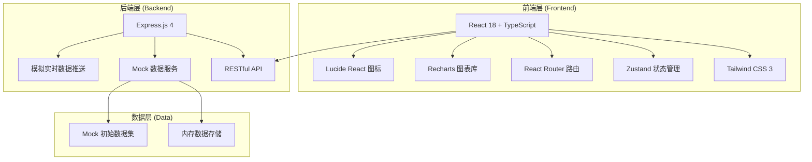
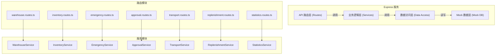
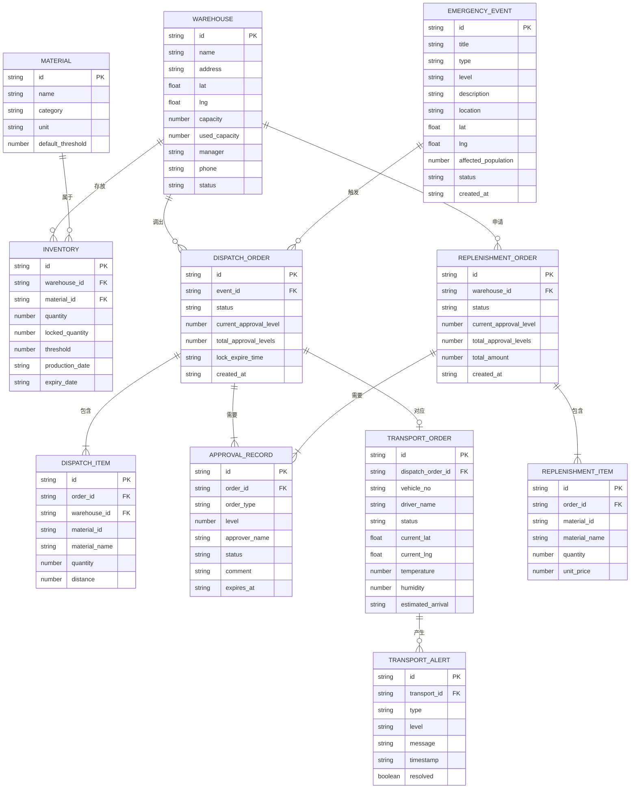

## 1. 架构设计



## 2. 技术选型说明

- **前端框架**: React 18 + TypeScript - 提供类型安全和组件化开发
- **构建工具**: Vite - 快速的开发构建体验
- **样式方案**: Tailwind CSS 3 - 原子化CSS，快速构建UI
- **状态管理**: Zustand - 轻量级状态管理，适合中大型应用
- **路由管理**: React Router DOM 6 - 声明式路由
- **图表组件**: Recharts - React生态下优秀的图表库
- **图标库**: Lucide React - 现代化线性图标
- **后端框架**: Express.js 4 - 轻量级Node.js Web框架
- **数据存储**: 内存数据 + Mock数据 - 演示用途，无需外部数据库
- **通信协议**: RESTful API + 模拟实时推送（setInterval）

## 3. 路由定义

| 路由路径 | 页面组件 | 功能说明 |
|----------|----------|----------|
| `/` | Dashboard | 首页大屏：实时数据展示、图表、地图 |
| `/warehouses` | WarehouseList | 仓库管理：储备库列表与详情 |
| `/inventory` | InventoryMonitor | 库存监控：实时库存、阈值预警、温湿度 |
| `/emergency` | EmergencyDispatch | 应急调拨：事件录入、方案推荐、库存锁定 |
| `/approvals` | ApprovalCenter | 审批中心：调拨与补货审批 |
| `/transport` | TransportMonitor | 运输监控：轨迹追踪、温湿度、异常告警 |
| `/replenish` | ReplenishmentManage | 补货管理：补货申请与审批追踪 |

## 4. API接口定义

### 4.1 通用响应结构

```typescript
interface ApiResponse<T> {
  code: number;
  message: string;
  data: T;
  timestamp: number;
}
```

### 4.2 仓库相关接口

```typescript
// GET /api/warehouses - 获取仓库列表
interface Warehouse {
  id: string;
  name: string;
  address: string;
  coordinates: { lat: number; lng: number };
  capacity: number;
  usedCapacity: number;
  manager: string;
  phone: string;
  status: 'active' | 'maintenance' | 'closed';
  temperature: number;
  humidity: number;
}

// GET /api/warehouses/:id - 获取仓库详情
// GET /api/warehouses/:id/inventory - 获取仓库库存明细
```

### 4.3 库存相关接口

```typescript
// GET /api/inventory - 获取所有库存
interface InventoryItem {
  id: string;
  warehouseId: string;
  warehouseName: string;
  materialId: string;
  materialName: string;
  category: 'medical' | 'food' | 'shelter' | 'equipment' | 'communication' | 'other';
  unit: string;
  quantity: number;
  lockedQuantity: number;
  availableQuantity: number;
  threshold: number;
  unitPrice: number;
  productionDate: string;
  expiryDate: string;
  lastUpdated: string;
}

// GET /api/inventory/warnings - 获取库存预警列表
// POST /api/inventory/:id/lock - 锁定库存
// POST /api/inventory/:id/unlock - 释放库存
```

### 4.4 应急调拨相关接口

```typescript
// POST /api/emergency/events - 创建突发事件
interface EmergencyEvent {
  id: string;
  title: string;
  type: 'earthquake' | 'flood' | 'fire' | 'epidemic' | 'typhoon' | 'other';
  level: 'level1' | 'level2' | 'level3' | 'level4';
  description: string;
  location: string;
  coordinates: { lat: number; lng: number };
  affectedPopulation: number;
  status: 'pending' | 'processing' | 'completed' | 'cancelled';
  createdAt: string;
  createdBy: string;
}

// POST /api/emergency/calculate-demand - 计算物资需求
interface MaterialDemand {
  materialId: string;
  materialName: string;
  category: string;
  requiredQuantity: number;
  unit: string;
  priority: 'high' | 'medium' | 'low';
}

// POST /api/emergency/recommend-plan - 获取推荐调拨方案
interface DispatchPlan {
  id: string;
  eventId: string;
  items: DispatchItem[];
  totalCost: number;
  estimatedTime: number;
  score: number;
}

interface DispatchItem {
  warehouseId: string;
  warehouseName: string;
  materialId: string;
  materialName: string;
  quantity: number;
  unit: string;
  distance: number;
}

// POST /api/emergency/dispatch - 提交调拨申请
interface DispatchOrder {
  id: string;
  planId: string;
  eventId: string;
  eventTitle: string;
  items: DispatchItem[];
  status: 'locked' | 'pending_approval' | 'approved' | 'rejected' | 'in_transit' | 'delivered' | 'cancelled';
  lockExpireTime: string;
  currentApprovalLevel: number;
  totalApprovalLevels: number;
  approvals: ApprovalRecord[];
  createdAt: string;
  createdBy: string;
}
```

### 4.5 审批相关接口

```typescript
// GET /api/approvals/pending - 获取待审批列表
interface ApprovalRecord {
  id: string;
  orderId: string;
  orderType: 'dispatch' | 'replenishment';
  level: number;
  totalLevels: number;
  approverId: string;
  approverName: string;
  status: 'pending' | 'approved' | 'rejected' | 'escalated';
  comment: string;
  createdAt: string;
  expiresAt: string;
}

// POST /api/approvals/:id/approve - 审批通过
// POST /api/approvals/:id/reject - 审批驳回
```

### 4.6 运输监控相关接口

```typescript
// GET /api/transport/active - 获取活跃运输列表
interface TransportOrder {
  id: string;
  dispatchOrderId: string;
  vehicleNo: string;
  driverName: string;
  driverPhone: string;
  status: 'loading' | 'in_transit' | 'delayed' | 'arrived' | 'completed';
  origin: { lat: number; lng: number; name: string };
  destination: { lat: number; lng: number; name: string };
  currentPosition: { lat: number; lng: number };
  currentTemperature: number;
  currentHumidity: number;
  temperatureRange: { min: number; max: number };
  humidityRange: { min: number; max: number };
  alerts: TransportAlert[];
  estimatedArrival: string;
  route: { lat: number; lng: number; timestamp: string }[];
  startedAt: string;
}

interface TransportAlert {
  id: string;
  transportId: string;
  type: 'temperature' | 'humidity' | 'route' | 'delay' | 'other';
  level: 'warning' | 'critical';
  message: string;
  timestamp: string;
  resolved: boolean;
}

// GET /api/transport/:id/track - 获取运输轨迹
```

### 4.7 补货相关接口

```typescript
// GET /api/replenishment - 获取补货申请列表
interface ReplenishmentOrder {
  id: string;
  warehouseId: string;
  warehouseName: string;
  items: ReplenishmentItem[];
  totalAmount: number;
  status: 'draft' | 'pending_approval' | 'approved' | 'rejected' | 'purchasing' | 'completed';
  currentApprovalLevel: number;
  totalApprovalLevels: number;
  approvals: ApprovalRecord[];
  createdAt: string;
  createdBy: string;
}

interface ReplenishmentItem {
  materialId: string;
  materialName: string;
  category: string;
  quantity: number;
  unit: string;
  unitPrice: number;
  currentStock: number;
  threshold: number;
}

// POST /api/replenishment - 创建补货申请
```

### 4.8 统计报表接口

```typescript
// GET /api/statistics/dashboard - 获取首页大屏数据
interface DashboardStats {
  totalInventory: number;
  totalWarehouses: number;
  activeDispatches: number;
  pendingApprovals: number;
  activeAlerts: number;
  turnoverRate: { date: string; rate: number }[];
  dispatchProgress: { status: string; count: number }[];
  responseTime: { warehouse: string; avgTime: number }[];
  recentActivities: Activity[];
}

// GET /api/statistics/monthly-report - 导出月度分析报告
```

## 5. 服务端架构图



## 6. 数据模型

### 6.1 ER图



### 6.2 目录结构说明

```
src/
├── components/          # 可复用组件
│   ├── dashboard/       # 首页大屏专用组件
│   ├── layout/          # 布局组件（导航、侧边栏等）
│   └── common/          # 通用组件（卡片、按钮、表格等）
├── pages/               # 页面组件
├── hooks/               # 自定义Hooks
├── store/               # Zustand状态管理
├── services/            # API调用服务
├── types/               # TypeScript类型定义
├── utils/               # 工具函数
└── App.tsx              # 应用入口

api/                    # Express后端代码
├── routes/             # API路由
├── services/           # 业务逻辑
├── data/               # Mock数据
└── index.ts            # 服务入口

shared/                 # 前后端共享类型
└── types.ts
```
